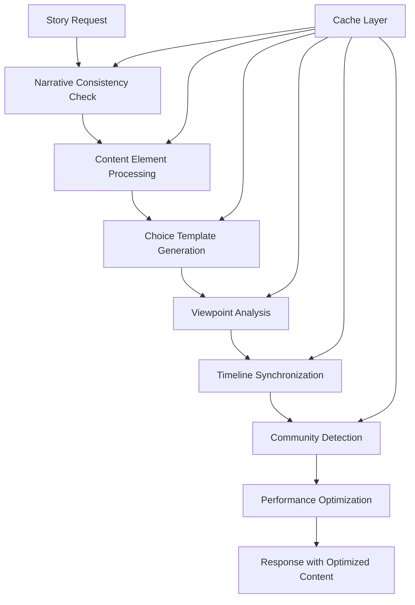

# Phase 2 Story Graph Architecture Documentation

## Overview

Phase 2 of the Ryuk story graph architecture introduces advanced narrative systems that build upon the foundational Phase 1 infrastructure. This phase focuses on sophisticated narrative management, intelligent content generation, and performance optimization to support complex storytelling scenarios.

## Table of Contents

1. [Architecture Overview](#architecture-overview)
2. [Core Systems](#core-systems)
3. [Service Documentation](#service-documentation)
4. [API Reference](#api-reference)
5. [Performance Considerations](#performance-considerations)
6. [Testing Strategy](#testing-strategy)
7. [Deployment Guidelines](#deployment-guidelines)

## Architecture Overview

### System Components

Phase 2 introduces six major service components:

```
┌─────────────────────────────────────────────────────────────┐
│                    Phase 2 Architecture                    │
├─────────────────────────────────────────────────────────────┤
│  ┌─────────────────┐  ┌─────────────────┐  ┌──────────────┐ │
│  │   Narrative     │  │    Content      │  │    Choice    │ │
│  │  Consistency    │  │   Elements      │  │  Templates   │ │
│  │   Validation    │  │                 │  │              │ │
│  └─────────────────┘  └─────────────────┘  └──────────────┘ │
│                                                             │
│  ┌─────────────────┐  ┌─────────────────┐  ┌──────────────┐ │
│  │   Viewpoint     │  │   Parallel      │  │  Community   │ │
│  │   Switching     │  │   Timelines     │  │  Detection   │ │
│  │                 │  │                 │  │              │ │
│  └─────────────────┘  └─────────────────┘  └──────────────┘ │
│                                                             │
│  ┌─────────────────────────────────────────────────────────┐ │
│  │         Performance Optimization Service               │ │
│  │  ┌─────────────┐ ┌─────────────┐ ┌─────────────────┐   │ │
│  │  │   Caching   │ │   Memory    │ │   Monitoring    │   │ │
│  │  │   System    │ │ Management  │ │  & Analytics    │   │ │
│  │  └─────────────┘ └─────────────┘ └─────────────────┘   │ │
│  └─────────────────────────────────────────────────────────┘ │
└─────────────────────────────────────────────────────────────┘
```

### Data Flow



## Core Systems

### 1. Narrative Consistency Validation

**Purpose**: Ensures story coherence across all narrative elements.

**Key Features**:
- Character behavior consistency checking
- Timeline conflict detection
- State contradiction analysis
- Trait violation identification
- Automated consistency reporting

**Use Cases**:
- Pre-publication story validation
- Real-time editing assistance
- Quality assurance for generated content
- Multi-author collaboration support

### 2. Content Element Management

**Purpose**: Manages rich multimedia content within story structures.

**Key Features**:
- Multi-format content support (text, image, audio, video)
- Rendering pipeline system
- Accessibility compliance
- Content validation and processing
- Metadata management

**Supported Content Types**:
- `text`: Formatted text content
- `image`: Visual assets with alt-text
- `audio`: Sound effects and music
- `video`: Video sequences
- `choice`: Interactive decision points
- `interaction`: Custom interactive elements

### 3. Choice Template System

**Purpose**: Enables intelligent, context-aware choice generation.

**Key Features**:
- Template-based choice creation
- Dynamic parameter substitution
- Conditional logic evaluation
- Usage analytics and optimization
- Multi-category template organization

**Template Categories**:
- `dialogue`: Conversation choices
- `action`: Physical action options
- `moral`: Ethical decision points
- `strategic`: Planning and tactics
- `emotional`: Feeling-based responses

### 4. Viewpoint Switching

**Purpose**: Manages narrative perspective changes and character focus.

**Key Features**:
- Multiple viewpoint type support
- Seamless perspective transitions
- Character accessibility analysis
- Reader experience optimization
- Narrative constraint management

**Viewpoint Types**:
- First person
- Second person
- Third person limited
- Third person omniscient
- Multiple POV
- Epistolary
- Stream of consciousness

### 5. Parallel Timeline Management

**Purpose**: Handles complex temporal narrative structures.

**Key Features**:
- Multiple timeline support
- Synchronization point management
- Temporal constraint validation
- Causality loop detection
- Timeline merging and splitting

**Timeline Types**:
- Main narrative thread
- Parallel storylines
- Flashbacks and flash-forwards
- Alternate timelines
- Hypothetical scenarios

### 6. Community Detection

**Purpose**: Analyzes narrative relationships and groupings.

**Key Features**:
- Multiple detection algorithms
- Character group identification
- Plot thread analysis
- Thematic clustering
- Network structure analysis

**Detection Algorithms**:
- Louvain community detection
- Leiden algorithm
- Label propagation
- Narrative-specific clustering

## Service Documentation

### NarrativeConsistencyService

#### Overview
Validates story consistency across multiple dimensions including character behavior, timeline coherence, and state management.

#### Key Methods

```typescript
// Validate entire story consistency
async validateStoryConsistency(storyId: string): Promise<ValidationResult>

// Check character behavior consistency
async validateCharacterConsistency(storyId: string): Promise<CharacterConsistencyResult>

// Validate timeline coherence
async validateTimelineConsistency(storyId: string): Promise<TimelineConsistencyResult>

// Generate comprehensive report
async generateConsistencyReport(storyId: string): Promise<ConsistencyReport>
```

#### Usage Example

```typescript
const consistency = await narrativeConsistencyService.validateStoryConsistency(storyId);

if (!consistency.is_consistent) {
  console.log('Violations found:', consistency.violations);

  // Handle critical violations
  const criticalViolations = consistency.violations.filter(v => v.severity === 'critical');
  for (const violation of criticalViolations) {
    console.log(`Critical: ${violation.description}`);
    console.log(`Suggested fix: ${violation.suggested_resolution}`);
  }
}
```

### ContentElementService

#### Overview
Manages rich content elements within story structures, supporting multiple media types and rendering pipelines.

#### Key Methods

```typescript
// Create new content element
async createContentElement(data: CreateContentElementNode): Promise<ContentElementNode>

// Render content with specific options
async renderContentElement(elementId: string, options: RenderingOptions): Promise<RenderedContent>

// Validate content element
async validateContentElement(elementId: string): Promise<ValidationResult>

// Search content elements
async searchContentElements(query: ContentSearchQuery): Promise<ContentElementNode[]>
```

#### Usage Example

```typescript
// Create text content element
const textElement = await contentElementService.createContentElement({
  stitch_id: stitchId,
  content_type: 'text',
  sequence_order: 1,
  content_data: {
    text: 'The protagonist enters the dark forest...',
    formatting: 'narrative',
  },
  rendering_hints: {
    display_style: 'paragraph',
    timing: 2000,
  },
});

// Render for web display
const rendered = await contentElementService.renderContentElement(textElement.id, {
  format: 'html',
  include_accessibility: true,
  target_device: 'web',
});
```

### ChoiceTemplateService

#### Overview
Provides intelligent choice generation using configurable templates with dynamic parameter substitution.

#### Key Methods

```typescript
// Create reusable choice template
async createTemplate(templateData: Omit<ChoiceTemplate, 'id' | 'created_at' | 'updated_at'>): Promise<ChoiceTemplate>

// Generate choices from templates
async generateChoices(request: ChoiceGenerationRequest): Promise<GeneratedChoice[]>

// Get template analytics
async getTemplateAnalytics(templateId: string): Promise<TemplateAnalytics>

// Update template usage statistics
async updateTemplateUsage(templateId: string, successful: boolean): Promise<void>
```

#### Usage Example

```typescript
// Generate contextual choices
const request = {
  scene_id: currentSceneId,
  desired_count: 3,
  categories: ['dialogue', 'action'],
  generation_mode: 'contextual',
  parameters: {
    character_name: 'Elena',
    emotional_state: 'determined',
  },
};

const choices = await choiceTemplateService.generateChoices(request);

for (const choice of choices) {
  console.log(`Choice: ${choice.choice_data.text}`);
  console.log(`Confidence: ${choice.confidence_score}`);
  console.log(`Template: ${choice.template_id}`);
}
```

### ViewpointSwitchingService

#### Overview
Manages narrative perspective transitions and character viewpoint analysis.

#### Key Methods

```typescript
// Create viewpoint configuration
async createViewpointConfiguration(configData: Omit<ViewpointConfiguration, 'id' | 'created_at' | 'updated_at'>): Promise<ViewpointConfiguration>

// Analyze scene viewpoint opportunities
async analyzeSceneViewpoint(sceneId: string): Promise<ViewpointAnalysis>

// Request viewpoint switch
async requestViewpointSwitch(request: ViewpointSwitchingRequest): Promise<ViewpointTransition>

// Optimize viewpoint usage
async analyzeViewpointOptimization(storyId: string): Promise<ViewpointOptimizationSuggestion[]>
```

#### Usage Example

```typescript
// Analyze current scene viewpoint
const analysis = await viewpointSwitchingService.analyzeSceneViewpoint(sceneId);

// Check for switching opportunities
if (analysis.switching_opportunities.length > 0) {
  const opportunity = analysis.switching_opportunities[0];

  if (opportunity.narrative_benefit > 0.8) {
    // Request viewpoint switch
    const transition = await viewpointSwitchingService.requestViewpointSwitch({
      current_scene_id: sceneId,
      target_character_id: opportunity.target_character,
      narrative_justification: 'Switch to reveal hidden motivations',
      maintain_continuity: true,
      reader_preparation_needed: true,
    });

    console.log(`Viewpoint switched to ${opportunity.target_character}`);
  }
}
```

### ParallelTimelineService

#### Overview
Manages complex temporal narrative structures with multiple concurrent timelines.

#### Key Methods

```typescript
// Create new timeline
async createTimeline(timelineData: Omit<Timeline, 'id' | 'created_at' | 'updated_at'>): Promise<Timeline>

// Add event to timeline
async addEventToTimeline(timelineId: string, eventId: string, temporalPosition: number): Promise<TimelineEvent>

// Synchronize multiple timelines
async synchronizeTimelines(timelineIds: string[], forceSync: boolean): Promise<SynchronizationResult>

// Analyze timeline consistency
async analyzeTimeline(timelineId: string): Promise<TimelineAnalysis>
```

#### Usage Example

```typescript
// Create parallel timeline for flashback sequence
const flashbackTimeline = await parallelTimelineService.createTimeline({
  story_id: storyId,
  name: 'Character Backstory',
  description: 'Events from the protagonist\'s past',
  timeline_type: 'flashback',
  temporal_anchor: {
    reference_type: 'relative',
    reference_point: triggerSceneId,
    time_scale: 'years',
    duration: 10,
  },
  synchronization_rules: {
    sync_type: 'loose',
    checkpoint_scenes: [currentSceneId],
    temporal_constraints: [],
  },
  metadata: {
    priority: 7,
    visibility: 'conditional',
    tags: ['backstory', 'character_development'],
    created_by: 'author',
    last_modified: new Date(),
  },
});

// Add events to the timeline
await parallelTimelineService.addEventToTimeline(
  flashbackTimeline.id,
  childhoodEventId,
  0.2 // 20% through the flashback timeline
);
```

### CommunityDetectionService

#### Overview
Analyzes narrative networks to identify character groups, plot threads, and thematic clusters.

#### Key Methods

```typescript
// Detect communities using specified algorithm
async detectCommunities(storyId: string, config: CommunityDetectionConfig): Promise<CommunityAnalysisResult>

// Analyze specific community characteristics
async analyzeCommunityCharacteristics(communityId: string): Promise<CommunityCharacteristics>

// Generate network insights
async generateNetworkInsights(storyId: string): Promise<NetworkInsights>
```

#### Usage Example

```typescript
// Detect character communities
const config = {
  algorithm: 'louvain',
  parameters: {
    resolution: 1.0,
    min_community_size: 3,
  },
  filters: {
    node_types: ['Character', 'Scene'],
    relationship_types: ['APPEARS_IN', 'INFLUENCES'],
  },
  analysis_depth: 'comprehensive',
};

const analysis = await communityDetectionService.detectCommunities(storyId, config);

// Analyze detected communities
for (const community of analysis.communities) {
  console.log(`Community: ${community.name}`);
  console.log(`Type: ${community.community_type}`);
  console.log(`Members: ${community.members.length}`);
  console.log(`Function: ${community.narrative_characteristics.story_function}`);

  // Check for optimization opportunities
  if (community.centrality_metrics.coherence_index < 0.6) {
    console.log('Consider strengthening community connections');
  }
}
```

### PerformanceOptimizationService

#### Overview
Monitors and optimizes system performance across all Phase 2 services.

#### Key Methods

```typescript
// Get comprehensive performance metrics
async getPerformanceMetrics(): Promise<PerformanceMetrics>

// Generate optimization recommendations
async generateOptimizationRecommendations(): Promise<OptimizationRecommendation[]>

// Optimize memory usage
async optimizeMemory(): Promise<MemoryOptimizationResult>

// Perform system health check
async healthCheck(): Promise<HealthCheckResult>
```

#### Usage Example

```typescript
// Monitor system performance
const metrics = await performanceOptimizationService.getPerformanceMetrics();

// Check for performance issues
if (metrics.query_performance.average_query_time > 1000) {
  console.warn('Query performance degraded');

  // Get optimization recommendations
  const recommendations = await performanceOptimizationService.generateOptimizationRecommendations();

  const highPriorityRecs = recommendations.filter(r => r.priority === 'high');
  for (const rec of highPriorityRecs) {
    console.log(`Recommendation: ${rec.title}`);
    console.log(`Expected improvement: ${rec.expected_improvement.performance_gain}%`);
    console.log('Implementation steps:', rec.implementation_steps);
  }
}

// Optimize memory if needed
if (metrics.memory_usage.heap_used / metrics.memory_usage.heap_total > 0.8) {
  const result = await performanceOptimizationService.optimizeMemory();
  console.log(`Memory optimization completed: ${result.actions_taken.join(', ')}`);
}
```

## API Reference

### REST Endpoints

#### Narrative Consistency

```http
POST /api/narrative-consistency/validate/{storyId}
GET  /api/narrative-consistency/report/{storyId}
POST /api/narrative-consistency/fix-violations
```

#### Content Elements

```http
POST /api/content-elements
GET  /api/content-elements/{elementId}
PUT  /api/content-elements/{elementId}
DELETE /api/content-elements/{elementId}
POST /api/content-elements/{elementId}/render
GET  /api/content-elements/search
```

#### Choice Templates

```http
POST /api/choice-templates
GET  /api/choice-templates/{templateId}
PUT  /api/choice-templates/{templateId}
DELETE /api/choice-templates/{templateId}
POST /api/choice-templates/generate
GET  /api/choice-templates/{templateId}/analytics
```

#### Viewpoint Switching

```http
POST /api/viewpoint/configurations
GET  /api/viewpoint/analyze/{sceneId}
POST /api/viewpoint/switch
GET  /api/viewpoint/optimization/{storyId}
GET  /api/viewpoint/history/{characterId}
```

#### Parallel Timelines

```http
POST /api/timelines
GET  /api/timelines/{timelineId}
PUT  /api/timelines/{timelineId}
DELETE /api/timelines/{timelineId}
POST /api/timelines/{timelineId}/events
POST /api/timelines/synchronize
GET  /api/timelines/{timelineId}/analyze
```

#### Community Detection

```http
POST /api/communities/detect/{storyId}
GET  /api/communities/{communityId}
GET  /api/communities/insights/{storyId}
```

#### Performance Optimization

```http
GET  /api/performance/metrics
GET  /api/performance/recommendations
POST /api/performance/optimize
GET  /api/performance/health
GET  /api/performance/cache/stats
```

### WebSocket Events

Real-time updates are provided via WebSocket connections:

```typescript
// Connect to Phase 2 events
const socket = new WebSocket('ws://localhost:3001/api/phase2/events');

// Listen for consistency validation updates
socket.on('consistency_validation_complete', (data) => {
  console.log('Validation completed:', data.result);
});

// Listen for performance alerts
socket.on('performance_alert', (data) => {
  console.warn('Performance issue:', data.alert);
});

// Listen for community detection results
socket.on('community_detection_complete', (data) => {
  console.log('Communities detected:', data.communities.length);
});
```

## Performance Considerations

### Caching Strategy

Phase 2 implements a multi-layer caching system:

1. **Service-Level Caching**
   - Narrative consistency results (TTL: 1 hour)
   - Choice template generations (TTL: 30 minutes)
   - Community detection results (TTL: 30 minutes)

2. **Database Query Caching**
   - Frequent graph queries (TTL: 10 minutes)
   - Node and relationship lookups (TTL: 5 minutes)

3. **Content Rendering Caching**
   - Rendered content elements (TTL: 2 hours)
   - Template expansions (TTL: 1 hour)

### Memory Management

- Automatic garbage collection triggers at 80% memory usage
- LRU eviction policies for all caches
- Background memory optimization every 30 minutes
- Connection pooling for database operations

### Query Optimization

- Cypher query optimization for large graphs
- Batch processing for bulk operations
- Parallel execution for independent analyses
- Index recommendations based on usage patterns

### Monitoring

Real-time monitoring includes:

- Query execution times
- Memory usage patterns
- Cache hit ratios
- Service response times
- Error rates and patterns

## Testing Strategy

### Unit Tests

Each service includes comprehensive unit tests covering:

- Core functionality validation
- Error handling scenarios
- Edge case behavior
- Performance characteristics

### Integration Tests

Cross-service integration testing validates:

- Data consistency across services
- Performance under concurrent load
- Error propagation and recovery
- Cache coherence

### Performance Tests

Automated performance testing includes:

- Load testing with varying story sizes
- Memory usage profiling
- Query performance benchmarking
- Concurrent operation testing

### End-to-End Tests

Complete workflow testing covers:

- Full story creation and analysis
- Multi-service narrative workflows
- Performance optimization cycles
- Real-world usage scenarios

## Deployment Guidelines

### System Requirements

**Minimum Requirements**:
- CPU: 4 cores, 2.5GHz
- RAM: 8GB
- Storage: 50GB SSD
- Network: 1Gbps

**Recommended for Production**:
- CPU: 8 cores, 3.0GHz+
- RAM: 16GB+
- Storage: 200GB+ NVMe SSD
- Network: 10Gbps

### Configuration

#### Environment Variables

```bash
# Phase 2 specific configurations
PHASE2_CACHE_ENABLED=true
PHASE2_CACHE_TTL_DEFAULT=1800
PHASE2_MAX_CONCURRENT_OPERATIONS=10
PHASE2_PERFORMANCE_MONITORING=true

# Service-specific settings
NARRATIVE_CONSISTENCY_CACHE_SIZE=100
CONTENT_ELEMENT_CACHE_SIZE=500
CHOICE_TEMPLATE_CACHE_SIZE=200
COMMUNITY_DETECTION_CACHE_SIZE=50

# Performance thresholds
MEMORY_WARNING_THRESHOLD=0.8
QUERY_TIME_WARNING_THRESHOLD=1000
CACHE_HIT_RATIO_WARNING=0.6
```

#### Production Deployment

```yaml
# docker-compose.yml additions for Phase 2
services:
  api:
    environment:
      - PHASE2_ENABLED=true
      - PERFORMANCE_OPTIMIZATION=true
    volumes:
      - ./cache:/app/cache
    deploy:
      resources:
        limits:
          memory: 4G
          cpus: '2'
        reservations:
          memory: 2G
          cpus: '1'

  redis:
    image: redis:7-alpine
    command: redis-server --maxmemory 1gb --maxmemory-policy allkeys-lru
```

### Monitoring and Alerts

#### Health Checks

```bash
# Basic health check
curl http://localhost:3001/api/performance/health

# Detailed metrics
curl http://localhost:3001/api/performance/metrics
```

#### Recommended Alerts

- Memory usage > 85%
- Average query time > 2 seconds
- Cache hit ratio < 50%
- Error rate > 5%
- Community detection time > 5 seconds

### Scaling Considerations

#### Horizontal Scaling

- Service instances can be load balanced
- Cache coherence managed via Redis
- Database connection pooling per instance

#### Vertical Scaling

- Memory-intensive operations benefit from more RAM
- CPU-intensive algorithms benefit from more cores
- SSD storage recommended for cache performance

#### Database Scaling

- Consider Neo4j clustering for large graphs
- Read replicas for analytics workloads
- Partitioning by story for very large datasets

## Troubleshooting

### Common Issues

#### Performance Degradation

**Symptoms**: Slow response times, high memory usage
**Solutions**:
1. Check cache hit ratios
2. Optimize database queries
3. Increase cache sizes
4. Enable memory optimization

#### Memory Leaks

**Symptoms**: Gradually increasing memory usage
**Solutions**:
1. Enable automatic garbage collection
2. Check for unclosed database connections
3. Review cache eviction policies
4. Monitor object lifecycle

#### Consistency Validation Failures

**Symptoms**: High number of validation violations
**Solutions**:
1. Review story structure
2. Check character development arcs
3. Validate timeline relationships
4. Update consistency rules

### Debug Mode

Enable debug logging:

```bash
export DEBUG=ryuk:phase2:*
export LOG_LEVEL=debug
```

### Support

For additional support:

1. Check the troubleshooting guide
2. Review service logs
3. Run health checks
4. Contact the development team

---

*This documentation covers Phase 2 of the Ryuk story graph architecture. For Phase 1 documentation, see [phase1-foundation.md](./phase1-foundation.md).*